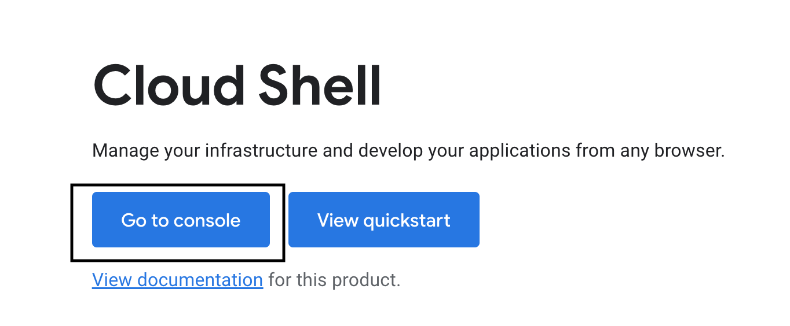

# Applying Solipsism to VRSpace

The scripts are in vrspace/content/worlds/solipsisworld/ folder. Basic usage of three.js is in three.js and three.html files. Basic application of solipsism to vrspace is in solpkg.js and solpkg.html files. movements.js and movements.html are main scripts in this project. 

## Prerequisites

1. Node.js installed
2. npm install -g solipsism 
3. npm install -g three 
4. npm install -g browserify
5. vrspace server installed in Docker container (refer to Build Environment.pdf)

## How to move objects according to the camera

In this part, we will realize two main features:
1. Move the avatar closer when you approach it (action-by-action)
2. Flip the avatar when you make a 360 move around it (remember the starting position and then keep track of when you complete a 360 round).

### Objects

We have two objects and one light:
1. A red ball
2. A green box
3. A spotlight
At the beginning, the red ball is above the green box and the spotlight is above both of the objects. The red ball is placed at the origin of the space. 

### Camera settings

We basically need two types of camera movements: 
1. Moving towards and away from the object
2. Moving around the object
That reminds us about the idea of polar coordinate. So in addition to the x-axis, y-axis, and z-axis, we also store the values of the radius (distance to the origin), and the angle (accumulative). We use r*Sin(angle) and r*Cos(angle) to transfer polar coordinate to cartesian coordinate, which is the camera position. 
We use keys (AWSD) to control the camera movements:
1. W: move towards the origin
2. S: move away from the origin
3. A: rotate left
4. D: rotate right
The speed of the camera can be customized by a scalar indicating the speed. 

### Object movement

Because we keep a record of the camera movement and position, we can move objects according to it. 
1. When we are pressing the key W, we also update the position of the ball. The direction can be calculated by the angle in the camera's record. 
2. Each time when we rotate the camera for 360 degrees, we update the position of the ball and the box by exchanging their y-axis values. 

## How to visualize using VRSpace server

1. Navigate to vrspace/content/worlds/solipsisworld/ and run in terminal: browserify movement.js > bundle2.js
2. Open Docker and start the container
3. Open the terminal and run: docker ps. Now you can see a list of container IDs that you are currently running, including the vrspace container.
4. Copy the container ID in the above output
5. Run in terminal: sudo docker cp (your vrspace directory)/vrspace/content/worlds/solipsisworld (the vrspace container ID you copied):/home/vrspace/content/worlds/solipsisworld
6. Open CLI for the vrspace container
7. In CLI run (same as you did when building the environment):
   1. cd vrspace
   2. cd server
   3. cd target
   4. java -jar server-0.4.7-SNAPSHOT.jar
8. Open http://localhost:8080/content/worlds/solipsisworld/movements.html

## Deploying the software to Google Cloud

In this part, we will deploy the VRSpace server to Google cloud Kubernetes cluster. 

### Creating the docker image

If you want to create the docker image by yourself: 
1. Navigate to vrspace folder
2. run: docker build -t (your docker id)/vrserver .
3. docker push (your docker id)/vrserver

You can also use the existed docker image from my docker hub: tristal25/vrserver

### Add the image to Google Cloud

Here I will use my docker image name (tristal25/vrserver). If you choose to use your own docker image, change all the image name to your own one. 
1. Create a project and copy the project ID
2. Navigate to cloud shell: search for cloud shell, click Cloud Shell tab. 
   
3. Go to cloud console:
   
4. In the cloud shell, run:
   1. Docker pull tristal25/vrserver
   2. Docker tag tristal25/vrserver gcr.io/(project ID)/tristal25/vrserver
   3. Docker push gcr.io/(project ID)/tristal25/vrserver
5. Navigate to Container registry, and you can see an image created under the folder tristal25/vrserver/
   
   

### Deploy to Kubernetes Engine

1. Go to Kubernetes Engine - Clusters
   
2. Click Deploy. In the Create a deployment tab, choose the created image in the image path:
   
3. Leave everything else to default and click continue
   
4. Change the application name to what you want (here I choose to name it vrserver). Click on Create new cluster if you don't have one, and choose the zone that you like. 
5. Click deploy and wait until the cluster and deployments are created. 
6. Now you are in the Workloads-vrserver. On the right side of the page, there is a button called Expose. Click the button. 
   
7. In expose, change both port and target port to 8080. Click Expose. 
   
8. Go to Workloads-vrserver. Find exposing service-endpoint. Copy the endpoint. 
   
9. The deployed VRSpace script is in this URL: http://(the endpoint that you copied)/content/worlds/solipsisworld/movements.html

